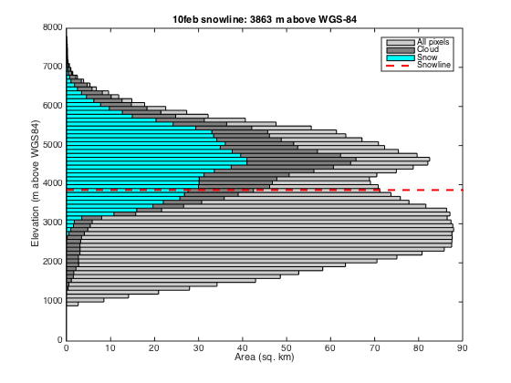
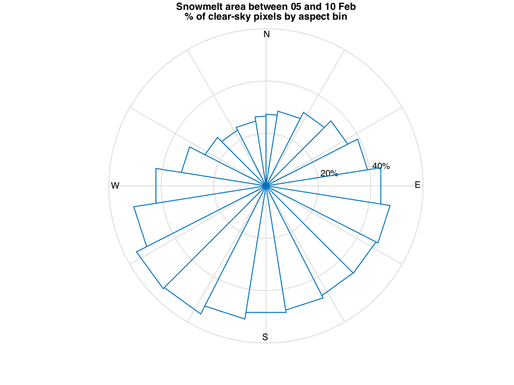

Code to compute the change in regional snow line elevation (RSLE) in the Chamoli region before and after the 07 Feb 2021 disaster

 

[Map source](https://umap.openstreetmap.fr/fr/map/region-of-interest-for-chamoli-snow_571403)


Contents
--------

-   [Load data](#1)
-   [Prepare masks](#2)
-   [Count pixels by elevation bins](#3)
-   [Find snowline elevation](#4)
-   [Test result](#5)
-   [Plot results](#6)
-   [Same analysis for 2021 Feb 10](#7)
-   [Check aspect of melt areas](#8)


Load data
---------

Sentinel-2 snow product (2021 Feb 05) obtained by atmospheric correction of level-1C image ([MAJA](https://logiciels.cnes.fr/en/content/maja)) and snow detection ([LIS](https://gitlab.orfeo-toolbox.org/remote_modules/let-it-snow/)) as described by [Gascoin et al. (2019)](https://www.earth-syst-sci-data.net/11/493/2019/essd-11-493-2019.html).

All data in WGS84 UTM44N, 20m resolution, extent 340200m 3391600m 402980m
3338560m

```Matlab
% Copernicus 30 m DEM resampled to 20m
[z,R] = geotiffread('ROIbb2/dem');
% Sentinel-2 FSC product from MAJA-LIS 
f = geotiffread('ROIbb2/fsc05feb');
% pixel area in km2
a = 1e-6*R.SampleSpacingInWorldX*R.SampleSpacingInWorldY;
```

Prepare masks
-------------

```Matlab
% no snow mask
ixns = f==0;
% snow mask
ixs = f>0 & f<=100;
% cloud mask
ixc = f>100;
```

Count pixels by elevation bins
------------------------------

```Matlab
% lower elevation edge
z1 = round(min(z(:))/100)*100;
% upper elevation edge
z2 = round(max(z(:))/100)*100;
% elevation bins edges
z_edges = z1:100:z2;
% elevation bins centers
z_center = z_edges(1:end-1) + mean(diff(z_edges))/2;
% count no snow pixels
ns = histcounts(z(ixs),z_edges);
% count cloud pixels
[nc,~] = histcounts(z(ixc),z_edges);
[nz,~] = histcounts(z,z_edges);
[nns,~] = histcounts(z(ixns),z_edges);
```

Find snowline elevation
-----------------------

Minimize sum of snow covered pixels below RSLE and land pixels above RSLE
(Krajci et al. 2014)

```Matlab
pspl = @(x) nnz(ixs & z<x) + nnz(ixns & z>x);
zs = fminbnd(pspl,double(z1),double(z2),optimset('TolX',10));
```

Test result
-----------

```Matlab
figure(1),clf,hold on
zx=z1:100:z2;
plot(zx,arrayfun(pspl,zx),'-')
plot(zs,pspl(zs),'ro')
ylabel('P_S+P_L')
xlabel('RSLE (m)')
legend('Test values','Optimum')
```


Plot results
------------

```Matlab
figure(2),clf
barh(z_center,nz*a,1,'facecolor',.8*[1 1 1]);
hold on
barh(z_center,(nc+ns)*a,1,'facecolor',.5*[1 1 1]);
barh(z_center,ns*a,1,'facecolor','c');
hrf = refline(0,zs);
set(hrf,'Color','r','LineStyle','--','LineWidth',2)
xlabel('Area (sq. km)')
ylabel('Elevation (m above WGS84)')
legend('All pixels','Cloud','Snow','Snowline')
title(sprintf('%s snowline: %4.4g m above WGS-84','05 Feb 2021',zs))
```


Same analysis for 2021 Feb 10
------------




Check aspect of melt areas
------------

```Matlab
% compute aspect in deg from the DEM
[fx,fy] = gradient(z);
za = rad2deg(wrapToPi(atan2(-fx,fy)));
% load Sentinel-2 FSC products
d1 = '05feb'; 
d2 = '10feb';
f1 = geotiffread(['ROIbb2/fsc' d1]);
f2 = geotiffread(['ROIbb2/fsc' d2]);
% Mask of melt areas
m = f1>0 & f2==0 & f1<=100 & f2<=100 ; 
% Mask of clear-sky areas
c = f1<=100 & f2<=100 ; 
% Plot polar histogram
[t,rc] = rose(deg2rad(za(c)),deg2rad(0:18:360));
[~,rm] = rose(deg2rad(za(m)),deg2rad(0:18:360));
r = 100*rm./rc;
r(isnan(r)) = 0;
polar(t,r,'-')
view(90, -90); % north up and angles increasing anti-clockwise 
title({'Snowmelt area between 05 and 10 Feb', '% of clear-sky pixels by aspect bin'})
```


